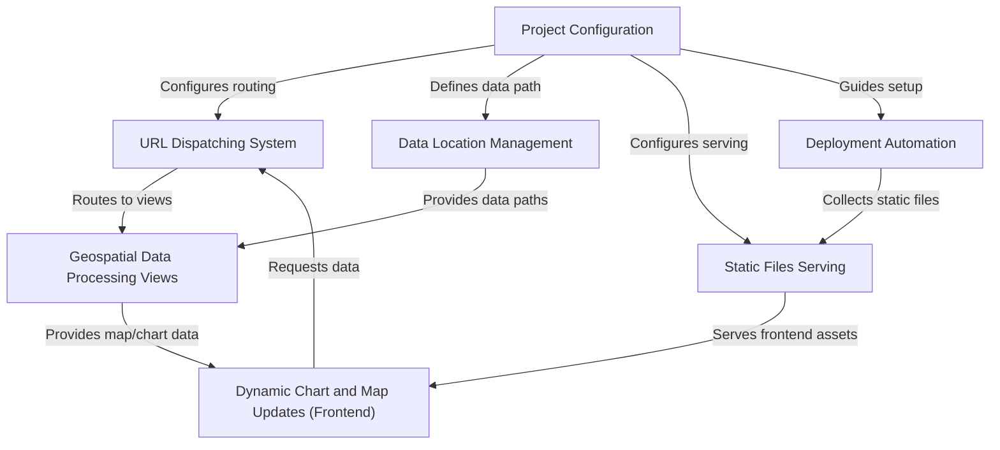
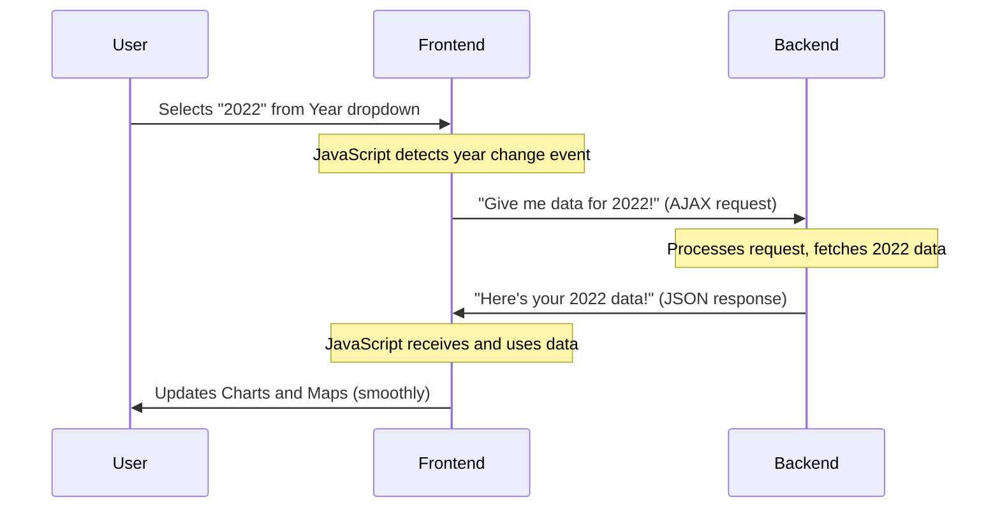
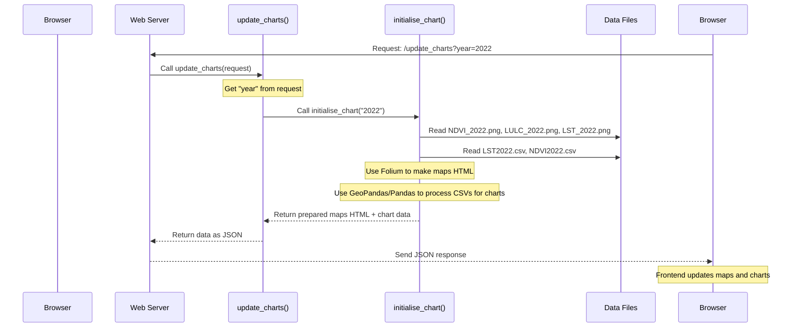
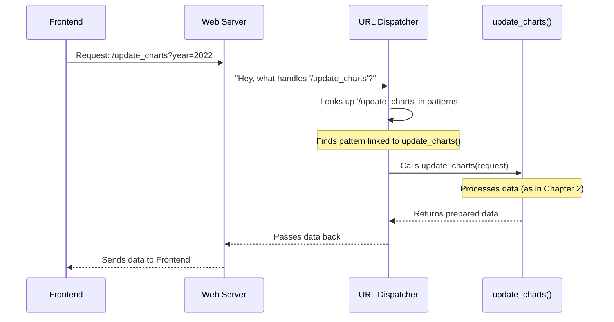
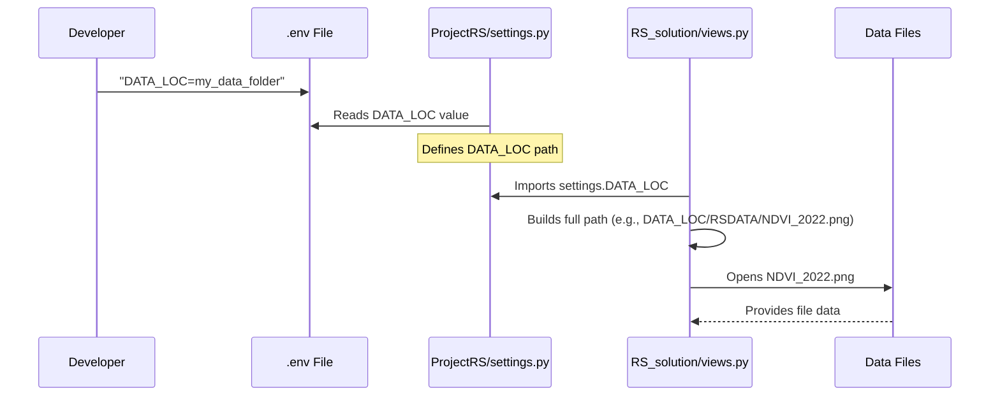
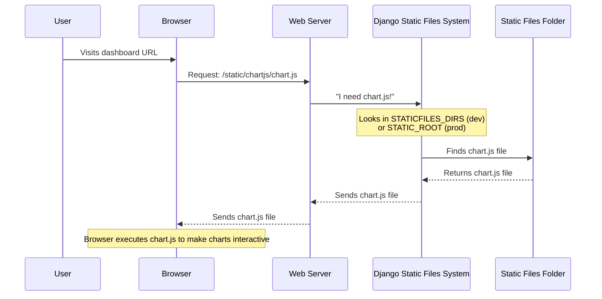
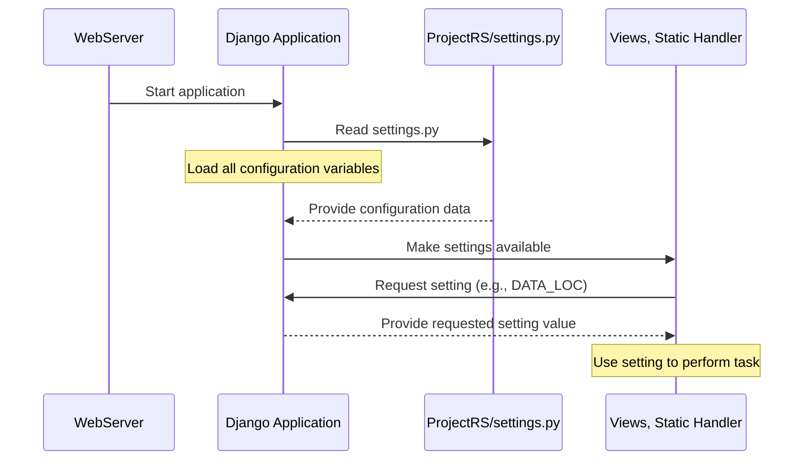
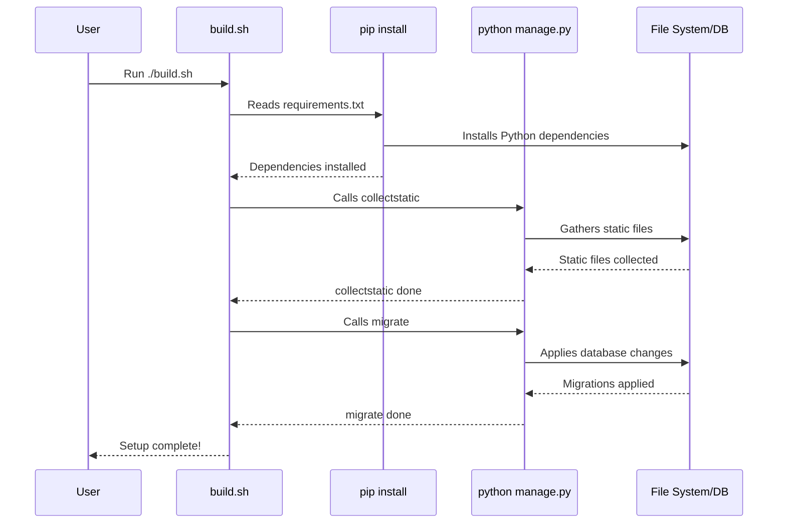

# Tutorial: change-detection-dashboard

The `change-detection-dashboard` project is a **Django web application** designed to visualize geospatial data. It allows users to view *interactive maps* and *time-series charts* of remote sensing data, such as NDVI and LST, for different years. The dashboard dynamically updates its displays based on user selections, providing a seamless and responsive experience for analyzing **environmental changes over time**.


## Visual Overview



## Chapters

1. [Dynamic Chart and Map Updates (Frontend)
](01_dynamic_chart_and_map_updates__frontend__.md)
2. [Geospatial Data Processing Views
](02_geospatial_data_processing_views_.md)
3. [URL Dispatching System
](03_url_dispatching_system_.md)
4. [Data Location Management
](04_data_location_management_.md)
5. [Static Files Serving
](05_static_files_serving_.md)
6. [Project Configuration
](06_project_configuration_.md)
7. [Deployment Automation
](07_deployment_automation_.md)

---
# Chapter 1: Dynamic Chart and Map Updates (Frontend)

Imagine you're looking at a weather dashboard on a website. You see charts showing temperature and maps showing rainfall. What if you want to see the data for a different year? Would you want the entire page to reload, making you wait and disrupting your flow? Probably not! You'd want the charts and maps to magically change to the new year's data right before your eyes, without any flickering or full page refreshes.

This is exactly the problem that "Dynamic Chart and Map Updates (Frontend)" solves in our `change-detection-dashboard` project. It's the "interactive display manager" that makes your experience smooth and responsive.

### What is the Frontend?

First, let's understand what we mean by "Frontend."
Think of a website like a restaurant:

*   **The Kitchen (Backend/Server):** This is where all the food is prepared, ingredients are stored, and complex cooking happens. In our dashboard, this is where the raw data lives and where complex calculations for charts and maps are done.
*   **The Dining Area (Frontend):** This is where you, the customer, sit. You see the tables, the decor, and the delicious food presented to you. In our dashboard, this is the web page you see in your browser – the charts, the maps, the buttons, and the dropdowns.

"Frontend" refers to everything you interact with directly in your web browser. It's built using languages like HTML (for structure), CSS (for style), and JavaScript (for interactivity).

### The Challenge: Updating Without Reloading

Traditionally, if you clicked a button on a website to see new information, the entire page would have to reload. This is slow and clunky. Our goal is to update only specific parts (like charts and maps) while the rest of the page stays exactly where it is.

The magic that allows this is called **AJAX** (Asynchronous JavaScript and XML, though nowadays we often use JSON instead of XML). Don't worry about the complex name! Just think of it as a way for your browser (Frontend) to quietly ask the server (Backend) for new information *without* bothering you or reloading the entire page.

### How it Works: A Simple Scenario

Let's walk through our main use case: **changing the year in a dropdown to update charts and maps.**

1.  **User Action**: You, the user, click on a "Year" dropdown menu on the dashboard and select a new year, say "2022".
2.  **Frontend Listens**: Our JavaScript code, running in your browser, is constantly "listening" for changes to that year dropdown. As soon as it detects your selection, it springs into action.
3.  **Silent Request**: The JavaScript then sends a "behind-the-scenes" request to the server, asking for the chart and map data specifically for the year "2022." This request happens in the background.
4.  **Server Responds**: The server processes this request, finds the data for 2022, and sends it back to your browser. This data is usually sent in a neatly organized format called JSON, which is like a structured list of information.
5.  **Frontend Updates**: Your JavaScript code receives this new data. It then takes this data and uses it to smoothly update just the charts and maps on your screen, without reloading anything else.

Here's a simplified sequence of events:



### Looking at the Code (Frontend Side)

The core logic for this dynamic update lives in the `static/chartjs/chart.js` file.

First, let's see the part that "listens" for your choice and kicks off the update:

```javascript
// static/chartjs/chart.js

// Function to handle year changes in the dropdown
function changeChartYear() {
  const yearSelector = document.querySelector("#yearSelection");
  // Get the selected year, default to '2021' if nothing is chosen
  activeYear = yearSelector.value || '2021';
  // Call updateCharts with the new year
  updateCharts(activeYear);
}

// Attach this function to the dropdown's "change" event
document.querySelector("#yearSelection").addEventListener("change", changeChartYear);
```
**Explanation:**
*   `document.querySelector("#yearSelection")`: This line finds the specific dropdown element on your web page that has the ID `yearSelection`.
*   `addEventListener("change", changeChartYear)`: This tells the browser: "Hey, whenever someone changes the value in the `yearSelection` dropdown, run the `changeChartYear` function!"
*   `changeChartYear` then grabs the selected year (`yearSelector.value`) and calls `updateCharts` with it.

Now, let's look at the `updateCharts` function, which is where the real "magic" happens. This function is responsible for sending the request to the server and updating the visuals.

```javascript
// static/chartjs/chart.js

// Function to fetch and update chart data
function updateCharts(selectedYear) {
  // 1. Send a request to the server
  fetch(`/update_charts?year=${selectedYear}`)
    // 2. When the server responds, convert the response to JSON
    .then(response => response.json())
    // 3. Once we have the data, update the charts and maps
    .then(data => {
      // Update maps by replacing HTML content
      document.querySelector('#map-container1').innerHTML = data.world_map;
      document.querySelector('#map-container2').innerHTML = data.world_map2;
      // ... (other map updates)

      // Update Chart 1 (NDVI)
      chart1.update({
        xAxis: { categories: data.graph1AXA }, // Update X-axis labels
        series: [{ data: data.graph1AYA }] // Update chart data
      });
      // ... (other chart1 config, simplified for brevity)

      // Update Chart 2 (LST)
      chart2.update({
        xAxis: { categories: data.graph1AX }, // Update X-axis labels
        series: [{ data: data.graph1AY }] // Update chart data
      });
      // ... (other chart2 config, simplified for brevity)
    });
}
```
**Explanation:**
1.  **`fetch(`/update_charts?year=${selectedYear}`)`**: This is the AJAX request! `fetch` is a modern JavaScript way to send network requests. It asks our server for information from a specific address (`/update_charts`) and includes the `selectedYear` as part of the request (e.g., `/update_charts?year=2022`).
2.  **`.then(response => response.json())`**: Once the server sends back a response, this part of the code takes that response and tells the browser to interpret it as JSON data.
3.  **`.then(data => { ... })`**: This is the most exciting part! After the data (now in a usable JavaScript `data` object) arrives, we use it to update our dashboard:
    *   **Maps**: `document.querySelector('#map-container1').innerHTML = data.world_map` means "find the HTML element with the ID `map-container1` and replace all its content with the new map HTML provided by the `data.world_map` part of the JSON." This is how maps "change" instantly.
    *   **Charts**: `chart1.update({...})` and `chart2.update({...})` are calls to the `Highcharts` library (which is what we use for our charts). These lines tell the existing chart objects to update their data (`series: [{ data: ... }]`) and axis labels (`xAxis: { categories: ... }`) with the new values from the `data` object. Highcharts then redraws the chart smoothly.

You might also see `static/bootstrap/js/bootstrap.bundle.min.js` and `static/bootstrap/js/bootstrap.min.js` in the project. These are pre-written JavaScript libraries (Bootstrap and jQuery) that help make web pages look good and respond to common interactions (like dropdowns, modals, etc.) easier. While they are part of the frontend, the core dynamic update logic we discussed is handled by our custom `chart.js` code.

### What's Under the Hood?

When your browser makes that `fetch` request, it's sending a message to the server, specifically to a part of the server that knows how to handle requests for `update_charts`. The server then looks at the `year` provided, retrieves the correct geospatial data for that year (this will be covered in detail in the [Geospatial Data Processing Views](02_geospatial_data_processing_views_.md) chapter!), processes it, generates the new chart data and map images, and then sends all of that back to the browser.

The key takeaway is that the frontend (your browser) doesn't have all the data upfront. It only asks for what it needs, when it needs it, and then intelligently updates just the necessary parts of the page. This makes the dashboard feel fast and responsive.

### Conclusion

In this chapter, we learned how the "Dynamic Chart and Map Updates (Frontend)" abstraction makes our dashboard interactive and user-friendly. By using JavaScript, we can send requests to the server for new data without full page reloads, and then smoothly update charts and maps using that data. This creates a much better experience for anyone using the dashboard.

Next, we'll dive into how the server-side handles these requests and processes the data to send back to the frontend. Get ready to explore [Geospatial Data Processing Views](02_geospatial_data_processing_views_.md)!

---

<sub><sup>**References**: [[1]](https://github.com/jessyie/change-detection-dashboard/blob/5a6bd4bc1edf46f9654716b64ef425f9d3ab07c0/static/bootstrap/js/bootstrap.bundle.min.js), [[2]](https://github.com/jessyie/change-detection-dashboard/blob/5a6bd4bc1edf46f9654716b64ef425f9d3ab07c0/static/bootstrap/js/bootstrap.min.js), [[3]](https://github.com/jessyie/change-detection-dashboard/blob/5a6bd4bc1edf46f9654716b64ef425f9d3ab07c0/static/chartjs/chart.js)</sup></sub>

# Chapter 2: Geospatial Data Processing Views

In [Chapter 1: Dynamic Chart and Map Updates (Frontend)](01_dynamic_chart_and_map_updates__frontend__.md), we learned how your web browser (the "Frontend") smartly asks for new data without reloading the whole page. When you select a new year from a dropdown, the Frontend sends a message, like "Hey server, I need the map and chart data for 2022!"

But who answers this request? Who actually goes and *gets* that data, processes it, and turns it into something the browser can display? That's where **Geospatial Data Processing Views** come in!

### What Problem Do They Solve?

Imagine you're running a busy restaurant. The waiter (Frontend) takes your order. But someone in the kitchen (Backend) needs to actually prepare the meal. In our dashboard, the "meals" are the interactive maps (showing things like vegetation health or temperature) and the time-series charts.

These views are like the "chefs" and "data analysts" of our application. When the Frontend asks for data for a specific year, these special Python functions jump into action. Their main job is to:

1.  **Read Geospatial Data**: Access files that contain geographical information (like satellite images or measurements tied to locations).
2.  **Process and Analyze**: Turn that raw data into something meaningful for our maps and charts.
3.  **Generate Visuals**: Create the actual interactive maps and prepare the numbers for the charts.
4.  **Send it Back**: Package everything up and send it to the Frontend.

### Key Ingredients: Views and Geospatial Data

Let's break down the core ideas:

*   **Views (in Python)**: In web development, a "view" is simply a Python function that runs when a specific web address (URL) is visited or requested. When the Frontend sent a request to `/update_charts`, it was asking a "view function" to do some work.
*   **Geospatial Data**: This is data that has a location on Earth. Think of it like a photograph taken from space, where each pixel has a specific latitude and longitude, and also tells us something about that location (e.g., how green the vegetation is, what the temperature is, or what kind of land cover is there).
    *   **NDVI (Normalized Difference Vegetation Index)**: A measure of vegetation greenness or plant health.
    *   **LST (Land Surface Temperature)**: The temperature of the Earth's surface.
    *   **LULC (Land Use Land Cover)**: What's on the ground (e.g., forests, water, urban areas).

Our project stores these as image files (like `.png` for the maps) and `.csv` files (for the chart data).

### The "Tools" in the Kitchen

To handle this special geospatial data, our views use powerful Python libraries:

| Library Name | What it Does (Simplified) |
| :----------- | :-------------------------------------------------------------- |
| **Folium**   | Helps create beautiful, interactive maps directly in Python. It's like a map-making machine. |
| **GeoPandas** | Makes it easy to work with geospatial data in a structured way, similar to how you'd use a spreadsheet but for locations and shapes. |
| **Pandas**   | A fundamental library for organizing and analyzing data in tables, like super-powered spreadsheets. |

### How It Works: The `update_charts` Process

Let's revisit our main example: **changing the year in a dropdown to update charts and maps.**

When the Frontend sends its request (e.g., `/update_charts?year=2022`), a specific view function on the server side catches it. This function is `update_charts`, located in `RS_solution/views.py`.

Here's a simplified sequence of events on the Backend (server) when that request arrives:



### Looking at the Code (Backend Side: `RS_solution/views.py`)

The heart of our data processing lies in two main functions: `update_charts` and `initialise_chart`.

First, let's look at `update_charts`. This function is the "door" that the Frontend's request comes through.

```python
# RS_solution/views.py

from django.http import JsonResponse
import os
from django.conf import settings

# This line helps us find where our data files are stored
data_loc_str = str(settings.DATA_LOC)

def update_charts(request):
    # Get the year that the user selected from the request
    selected_year = request.GET.get("year")

    # If no year is selected, or if the year is empty, handle it.
    # The actual project has more specific checks here.
    if not selected_year:
        selected_year = '2021' # Default to a year if none provided

    # The real work of preparing data and maps is done by initialise_chart
    data = initialise_chart(selected_year)
        
    # Send the prepared data back to the browser as a JSON response
    return JsonResponse(data)
```
**Explanation:**
*   `def update_charts(request):`: This defines our view function. It receives a `request` object, which contains all the details of the incoming web request (like the selected year).
*   `selected_year = request.GET.get("year")`: This line safely gets the `year` value from the request. Remember the `?year=2022` part in the URL? This is how the server extracts "2022".
*   `data = initialise_chart(selected_year)`: This is where the magic happens! Instead of `update_charts` doing all the heavy lifting itself, it delegates to another helper function, `initialise_chart`, passing the `selected_year` to it. This makes the code cleaner and easier to manage.
*   `return JsonResponse(data)`: After `initialise_chart` finishes preparing all the map HTML and chart data, `update_charts` packages it into a special format called JSON and sends it back to the Frontend.

Now, let's peek inside `initialise_chart`, the actual "data processing chef":

```python
# RS_solution/views.py (inside initialise_chart function)

import folium
import pandas as pd
import geopandas as gpd

def initialise_chart(year = '2021'): # It takes the year as input
    # --- Part 1: Generating Maps (e.g., NDVI map) ---
    # Build the full path to the NDVI image file for the given year
    # Example: C:\path\to\your\data\RSDATA\NDVI_2022.png
    ndvi_image_path = os.path.join(data_loc_str, 'RSDATA', 'NDVI_' + year + '.png')

    # Create a new Folium map, centered over a specific location
    world_map = folium.Map(location=[9.3054, -1.2591], zoom_start= 6.5)

    # Define the corners of the image on the map (Northern Lat, Western Lon), (Southern Lat, Eastern Lon)
    bounds = [[11.0257, -3.4226], [7.8539, 1.0593]]

    # Overlay the NDVI image onto the map
    folium.raster_layers.ImageOverlay(ndvi_image_path, bounds=bounds, opacity=1).add_to(world_map)
    
    # Add optional map layers (like terrain or toner) for better context
    folium.raster_layers.TileLayer('Stamen Terrain').add_to(world_map)
    folium.LayerControl().add_to(world_map) # Allows user to switch map layers

    # Convert the Folium map object into HTML code
    world_map_html = world_map._repr_html_()

    # Similar steps are repeated for LULC and LST maps... (simplified for brevity)
    
    # --- Part 2: Preparing Chart Data (e.g., LST time-series) ---
    # Build the full path to the LST CSV file for the given year
    # Example: C:\path\to\your\data\RSDATA\LST2022.csv
    lst_csv_path = os.path.join(data_loc_str, 'RSDATA', 'LST' + year + '.csv')
    
    # Read the CSV file into a GeoPandas DataFrame (like a smart spreadsheet)
    df_lst = gpd.read_file(lst_csv_path)

    # Select the columns we need for the chart: time and LST value
    df_lst_filtered = df_lst[["system:time_start", "LST_Day_1km"]]
    # Convert the LST values from text to numbers so we can plot them
    df_lst_filtered["LST_Day_1km"] = df_lst_filtered["LST_Day_1km"].astype('float')

    # Extract the data for the chart's X-axis (time) and Y-axis (LST values)
    chart_x_labels = df_lst_filtered['system:time_start'].values.tolist()
    chart_y_values = df_lst_filtered['LST_Day_1km'].values.tolist()

    # Similar steps are repeated for NDVI chart data... (simplified for brevity)

    # --- Part 3: Packaging all the data ---
    context = {
        'world_map' : world_map_html, # Our first map's HTML
        'world_map2' : '...',        # HTML for LULC map (from similar code)
        'world_map3' : '...',        # HTML for LST map (from similar code)
        'graph1AX' : chart_x_labels, # X-axis labels for LST chart
        'graph1AY' : chart_y_values, # Y-axis values for LST chart
        'graph1AXA' : '...',         # X-axis labels for NDVI chart (from similar code)
        'graph1AYA' : '...'          # Y-axis values for NDVI chart (from similar code)
    }
    return context # This dictionary is what update_charts sends back as JSON
```
**Explanation:**
*   `initialise_chart(year = '2021')`: This function takes the `year` as an input. This is how it knows *which year's* data to load. It also has a default of '2021' if no year is provided.
*   **Map Generation**:
    *   `os.path.join(data_loc_str, ...)`: This line helps build the correct file path to the image data (like `NDVI_2022.png`). `data_loc_str` comes from our project's configuration (we'll cover this in [Data Location Management](04_data_location_management_.md)).
    *   `folium.Map(...)`: Creates a basic interactive map.
    *   `folium.raster_layers.ImageOverlay(...)`: This is the key part for displaying our satellite image. It takes the path to our `NDVI_2022.png` image and "sticks" it onto the map using `bounds` (which define the image's geographical corners).
    *   `world_map._repr_html_()`: Folium generates the map as a special piece of HTML code that the browser can display. This HTML is what gets sent to the Frontend.
*   **Chart Data Processing**:
    *   `gpd.read_file(lst_csv_path)`: This line uses GeoPandas to read the `LST2022.csv` file. It's great because it understands that this data might have geographical information.
    *   `df_lst_filtered = df_lst[["system:time_start", "LST_Day_1km"]]`: We select only the columns we need for our chart (the date/time and the LST value).
    *   `astype('float')`: This ensures that the LST values are treated as numbers, not just text, which is crucial for plotting them correctly.
    *   `values.tolist()`: We convert the data into simple Python lists, which is a format that JavaScript (Highcharts in the Frontend) can easily understand and use to draw the charts.
*   `context = {...}`: Finally, all the generated map HTML and processed chart data are put into a Python dictionary. This dictionary becomes the `data` that `update_charts` sends back as JSON.

### Conclusion

In this chapter, we've explored the "brains" of our dashboard: the **Geospatial Data Processing Views**. These Python functions act as skilled data analysts and map makers. They receive requests from the browser, fetch the correct geospatial data files (like satellite images and measurement CSVs) for a given year, process them using libraries like Folium and GeoPandas, generate interactive maps and prepare data for charts, and then send all this neatly packaged information back to the browser. This seamless backend processing is what makes our dashboard dynamic and informative.

Next, we'll discover how the server knows *which* of these view functions to call when a specific web address (URL) is requested. Get ready to learn about the [URL Dispatching System](03_url_dispatching_system_.md)!

---

<sub><sup>**References**: [[1]](https://github.com/jessyie/change-detection-dashboard/blob/5a6bd4bc1edf46f9654716b64ef425f9d3ab07c0/RS_solution/views.py)</sup></sub>

# Chapter 3: URL Dispatching System

In [Chapter 1: Dynamic Chart and Map Updates (Frontend)](01_dynamic_chart_and_map_updates__frontend__.md), you learned how your web browser (the Frontend) cleverly sends a request to the server whenever you select a new year, for example, asking for data for `/update_charts?year=2022`. Then, in [Chapter 2: Geospatial Data Processing Views](02_geospatial_data_processing_views_.md), we explored the "view functions" on the server side (like `update_charts`) that actually process this request, fetch data, and prepare the maps and charts.

But here's a crucial question: How does the server know *which* of its many Python functions (view functions) it should call when it receives a request for a specific URL like `/update_charts`?

This is exactly the problem that the **URL Dispatching System** solves!

### What Problem Does it Solve?

Imagine our web application is a busy city, and each different task (like displaying a map, updating charts, or showing the home page) is a specific building or office within that city.

When a user types a web address (a URL) into their browser, it's like someone giving an address to a taxi driver. The **URL Dispatching System** acts as the city's "GPS" or "traffic controller." Its job is to:

1.  **Receive the URL**: Get the web address requested by the user.
2.  **Look it up**: Check its "address book" (a list of URL patterns).
3.  **Direct the traffic**: Guide that incoming request to the *exact right Python function* (our "view") that is designed to handle it.

Without this system, the server would be lost! It wouldn't know which part of your code is supposed to deal with a request for `/update_charts` versus a request for the main `/` (home) page.

### Key Concepts

Let's break down the essential ideas:

*   **URL (Uniform Resource Locator)**: This is the web address you type, like `https://www.example.com/about` or just a path like `/update_charts`.
*   **View Function**: As we saw in Chapter 2, this is a regular Python function (like `update_charts`) that takes a web request and returns a web response.
*   **URL Pattern / Route**: This is a rule that links a specific URL path to a specific view function. Think of it as an entry in the "address book."

### How It Works: The `/update_charts` Example

Let's trace our familiar use case: **when the browser requests `/update_charts` to get new data.**

1.  **User Action**: You, the user, select a year in the dropdown.
2.  **Frontend Sends Request**: Your browser (Frontend) sends a request for `/update_charts?year=2022` to the server.
3.  **Server Receives Request**: Our web server receives this incoming request.
4.  **URL Dispatcher Kicks In**: The URL Dispatching System immediately steps in. It takes the path `/update_charts` and looks through its defined "URL patterns."
5.  **Match Found!**: It finds a pattern that matches `/update_charts`. This pattern is linked to a specific Python view function, `update_charts` (which lives in `RS_solution/views.py`).
6.  **View Function is Called**: The dispatcher calls the `update_charts` function, passing all the request details (including `year=2022`) to it.
7.  **Response Sent Back**: The `update_charts` function does its work (as described in Chapter 2) and sends back the processed data, which then travels back through the server to your browser.

Here's a simplified view of this process:



### Looking at the Code: Defining URL Patterns

In our `change-detection-dashboard` project, these "address books" or "URL patterns" are defined in special Python files named `urls.py`. Django, our web framework, uses these files to set up the dispatching system.

There are usually two levels of `urls.py` files in a Django project:

1.  **Project-level `urls.py`**: This is the main "entry point" for all URLs. It often directs requests to specific "apps" within the project.
2.  **App-level `urls.py`**: Each separate part of your project (called an "app") can have its own `urls.py` to define the patterns specific to that app. This helps keep things organized!

Let's look at `ProjectRS/urls.py` (the project-level one) first:

```python
# ProjectRS/urls.py

from django.contrib import admin
from django.urls import path, include # We need 'include' here!

urlpatterns = [
    # If the URL is empty (just '/'), send it to RS_solution's URL patterns
    path('', include('RS_solution.urls')),
    # This is for the admin site, not part of our main dashboard logic
    path('to-secret-admin/', admin.site.urls),
]
```
**Explanation:**
*   `urlpatterns = [...]`: This is a Python list where we define all our URL patterns.
*   `path('', include('RS_solution.urls'))`: This is a very important line! It says: "If the URL path is empty (meaning the root of our website, like `http://localhost:8000/`), then don't handle it here directly. Instead, send this request over to the `urls.py` file inside our `RS_solution` app." This is how Django allows you to build large applications by breaking down URL handling into smaller, manageable pieces.

Now, let's look at `RS_solution/urls.py` (the app-level one), which actually contains the patterns for our dashboard:

```python
# RS_solution/urls.py

from django.urls import path
from . import views # We import our view functions from views.py

urlpatterns = [
    # 1. If the URL is empty (''), call the 'map' view function
    path('', views.map, name='map'),
    # 2. If the URL is 'update_charts/', call the 'update_charts' view function
    path('update_charts/', views.update_charts, name='update_charts'),
    # (Other patterns like 'reset_map' are commented out or simplified)
]
```
**Explanation:**
*   `from . import views`: This line imports all the functions from our `views.py` file (like `map` and `update_charts`) so we can link them to URLs. The `.` means "from the current directory/app."
*   `path('', views.map, name='map')`: This pattern says: "If the URL path is empty (after being handled by the project's `urls.py`), then call the `map` function from `views.py`." This is what displays our initial dashboard page.
*   `path('update_charts/', views.update_charts, name='update_charts')`: This is the pattern we've been looking for! It says: "If the URL path is exactly `update_charts/`, then call the `update_charts` function from `views.py`." This is how the `/update_charts` request from the Frontend gets routed to the correct processing function on the Backend.
*   `name='map'` and `name='update_charts'`: These are optional names for our URL patterns. They're very useful for building links in your application without having to hardcode the URLs. For instance, if the URL for `update_charts` ever changes, you only need to update it in one place, and any code referring to its `name` will still work.

### Conclusion

The **URL Dispatching System** is the unsung hero that ensures your web requests always find their way to the right handler. It's like the central switchboard for your web application, efficiently directing incoming traffic (URLs) to the appropriate Python functions (views). By defining these clear paths in `urls.py` files, we build a structured and organized web application that can handle many different requests.

Now that we understand how requests are routed, next we'll explore how our application knows *where* to find all the different data files (like satellite images and CSVs) it needs to process. Get ready to learn about [Data Location Management](04_data_location_management_.md)!

---

<sub><sup>**References**: [[1]](https://github.com/jessyie/change-detection-dashboard/blob/5a6bd4bc1edf46f9654716b64ef425f9d3ab07c0/ProjectRS/urls.py), [[2]](https://github.com/jessyie/change-detection-dashboard/blob/5a6bd4bc1edf46f9654716b64ef425f9d3ab07c0/RS_solution/urls.py)</sup></sub>

# Chapter 4: Data Location Management

In our previous chapters, you learned how your web browser (the Frontend) requests data (Chapter 1), how the server-side "view functions" process that data (Chapter 2: [Geospatial Data Processing Views](02_geospatial_data_processing_views_.md)), and how the [URL Dispatching System](03_url_dispatching_system_.md) directs those requests to the right view function.

Now, let's think about the actual data files! Our dashboard uses lots of geospatial data, like NDVI images (`NDVI_2022.png`) and LST CSV files (`LST2022.csv`). These files are stored somewhere on your computer or on the server where the application is running.

So, here's a crucial question: How does our Python code, specifically the `initialise_chart` function in `RS_solution/views.py` (which you saw in Chapter 2), know *where* to find these files?

This is exactly the problem that **Data Location Management** solves!

### What Problem Does it Solve?

Imagine our application is a "data librarian." It needs to fetch specific books (our data files) whenever someone asks for them (like when you select a new year).

If the librarian only knew one specific shelf (e.g., "always look in `C:\Users\YourName\MyProject\data`"), what would happen if you moved the books to a different room, or if someone else wanted to use your library but their "data room" was named differently? The librarian would be lost!

The problem is **hardcoding paths** – writing the exact, fixed location of a file directly into your code. This is bad because:
*   **Not Flexible**: If you move your data folder, the code breaks.
*   **Not Portable**: If someone else runs your code, their data folder might be in a different place, so the code won't work for them without changes.
*   **Hard to Manage**: You'd have to change many lines of code if data locations ever changed.

**Data Location Management** acts like a "smart librarian" for our project. Instead of hardcoding paths, it provides a configurable way to specify *where* the data files are located. This makes our application much more flexible and portable, allowing it to easily find its necessary datasets whether deployed locally on your computer or on a different server, without requiring you to change the actual Python code.

### Key Concepts

Let's break down how our "smart librarian" works:

*   **Project Configuration (`settings.py`)**: This is like the main rulebook for our entire Django project. It's where we store important settings, including where our data should be.
*   **Base Directory (`BASE_DIR`)**: This is a special setting that always points to the very root folder of our project. Think of it as the "home base." From this home base, we can define relative paths to other folders.
*   **Data Location Setting (`DATA_LOC`)**: This is a custom setting we define in `settings.py` to specifically point to our main data folder.
*   **Environment Variables (`.env` file)**: This is a small, plain text file where we can store secret or environment-specific settings, like the exact name of our data folder, *outside* of our main code. This is great for keeping sensitive information private and for easily changing settings for different deployments (e.g., "my local machine" vs. "the cloud server").

### How It Works: Finding Your Data Files

Let's trace how our application finds a file like `NDVI_2022.png` when `initialise_chart` needs it:

1.  **Define Data Location in `.env`**: First, you, the developer, tell the project where the data folder is by setting a simple entry in a `.env` file. This file usually sits at the root of your project.
2.  **Read Settings in `settings.py`**: Our main `settings.py` file reads this value from the `.env` file and uses it to define `DATA_LOC`. It also knows the `BASE_DIR` (the project's root).
3.  **Access Settings in `views.py`**: When `initialise_chart` needs a file, it imports the `settings` object and uses the `DATA_LOC` value.
4.  **Build Full Path**: It then cleverly combines `DATA_LOC` with the specific filename (`NDVI_2022.png`) to create the complete, correct path to the file, no matter where `DATA_LOC` actually points.
5.  **Open the File**: Finally, it uses this complete path to open and read the data file.

Here's a simplified sequence of events:



### Looking at the Code: Defining Data Locations

The core of this system involves three key places in our project:

1.  **The `.env` file**: This is a simple text file you create at the root of your project.
2.  **`ProjectRS/settings.py`**: This is where our application reads the `DATA_LOC` value and makes it available.
3.  **`RS_solution/views.py`**: This is where our view functions actually use the `DATA_LOC` to find files.

Let's look at each part.

#### 1. The `.env` file

This file doesn't exist by default; you create it yourself. It's usually placed in the same directory as your `manage.py` file.

```
# .env
DATA_LOC=my_geospatial_data
```
**Explanation:**
*   `DATA_LOC=my_geospatial_data`: This line tells our application that the main folder containing all our raw geospatial data is named `my_geospatial_data`. You can change `my_geospatial_data` to whatever your actual data folder is called (e.g., `remote_sensing_data`, `data`). This value will be joined with the project's base directory later.

#### 2. `ProjectRS/settings.py`

This file is where Django loads all its important configuration. We'll add some lines to tell it about our `DATA_LOC`.

```python
# ProjectRS/settings.py
import os
from pathlib import Path
from decouple import config # Important: We need 'config' to read .env files!

# This gets the path to our project's main folder
BASE_DIR = Path(__file__).resolve().parent.parent

# Define where our main data folder is located.
# It joins the BASE_DIR with the value read from our .env file.
# If DATA_LOC isn't in .env, it defaults to 'data'.
DATA_LOC = BASE_DIR / config('DATA_LOC', default='data')

# ... (rest of your settings.py file)
```
**Explanation:**
*   `from decouple import config`: This line imports a special helper that allows our Django project to easily read values from the `.env` file.
*   `BASE_DIR = Path(__file__).resolve().parent.parent`: This is a standard Django line that automatically figures out the full path to the very top level of your project (where `manage.py` is located).
*   `DATA_LOC = BASE_DIR / config('DATA_LOC', default='data')`: This is the magic line for data location!
    *   `config('DATA_LOC')`: This tells the `decouple` library to look for a variable named `DATA_LOC` in our `.env` file.
    *   `BASE_DIR / ...`: This is a modern Python way to join file paths. It automatically handles the correct slashes (`/` or `\`) depending on your operating system. So, if `BASE_DIR` is `/home/user/project` and `DATA_LOC` from `.env` is `my_geospatial_data`, `DATA_LOC` will become `/home/user/project/my_geospatial_data`.
    *   `default='data'`: This is a safety net. If you forget to put `DATA_LOC` in your `.env` file, it will assume your data folder is simply named `data` inside your main project folder.

#### 3. `RS_solution/views.py`

Now that `DATA_LOC` is defined in `settings.py`, our view functions can use it to find the data files.

```python
# RS_solution/views.py
import os
from django.conf import settings # Important: We need 'settings' to access project settings

# Convert the DATA_LOC path to a simple string, which 'os.path.join' prefers.
data_loc_str = str(settings.DATA_LOC)

def initialise_chart(year = '2021'):
    # --- Part 1: Generating Maps ---
    # Now we build the full path to the NDVI image file dynamically!
    # Example: /home/user/project/my_geospatial_data/RSDATA/NDVI_2022.png
    ndvi_image_path = os.path.join(data_loc_str, 'RSDATA', 'NDVI_' + year + '.png')

    # ... (Folium code uses ndvi_image_path) ...

    # --- Part 2: Preparing Chart Data ---
    # Build the full path to the LST CSV file
    # Example: /home/user/project/my_geospatial_data/RSDATA/LST2022.csv
    lst_csv_path = os.path.join(data_loc_str, 'RSDATA', 'LST' + year + '.csv')
    
    # ... (GeoPandas code reads lst_csv_path) ...

    # ... (rest of the function) ...
```
**Explanation:**
*   `from django.conf import settings`: This line allows us to access all the variables defined in our `settings.py` file from any part of our application.
*   `data_loc_str = str(settings.DATA_LOC)`: We take the `DATA_LOC` object (which is a `Path` object) and convert it into a simple string, as the `os.path.join` function often works best with strings.
*   `os.path.join(data_loc_str, 'RSDATA', 'NDVI_' + year + '.png')`: This is the core line for building file paths.
    *   `data_loc_str`: This is our base data folder path (e.g., `/home/user/project/my_geospatial_data`).
    *   `'RSDATA'`: This is a subfolder *inside* our main data folder where the actual image and CSV files are kept.
    *   `'NDVI_' + year + '.png'`: This dynamically creates the filename, for example, `NDVI_2022.png`.
    *   `os.path.join` smartly combines these pieces, adding the correct `/` or `\` symbols as needed, regardless of your computer's operating system.

This setup means that if you move your `my_geospatial_data` folder or share your project with someone else, you only need to change one line in the `.env` file to tell the application its new location!

### Conclusion

The **Data Location Management** system acts as the "smart librarian" for our `change-detection-dashboard` project. By configuring the `DATA_LOC` setting in `settings.py` (which reads from a `.env` file) and using `os.path.join` in our view functions, we avoid hardcoding file paths. This makes our application flexible, portable, and much easier to manage, ensuring it can always find its essential geospatial data files.

Next, we'll explore another important aspect of file management: how our web application serves all the CSS, JavaScript, and images that make our dashboard look good and function interactively. Get ready to learn about [Static Files Serving](05_static_files_serving_.md)!

---

<sub><sup>**References**: [[1]](https://github.com/jessyie/change-detection-dashboard/blob/5a6bd4bc1edf46f9654716b64ef425f9d3ab07c0/ProjectRS/settings.py), [[2]](https://github.com/jessyie/change-detection-dashboard/blob/5a6bd4bc1edf46f9654716b64ef425f9d3ab07c0/RS_solution/views.py)</sup></sub>

# Chapter 5: Static Files Serving

In [Chapter 4: Data Location Management](04_data_location_management_.md), we learned how our application finds the actual *geospatial data* (like images and CSVs) it needs to process. But what about all the other files that make our dashboard look good and work smoothly? Think about the stylish design (CSS stylesheets), the interactive buttons and dropdowns (JavaScript libraries like Bootstrap), and any logos or icons (images). These files are not dynamic data; they are fixed, supporting assets.

So, how does our web application deliver these essential "non-data" files to your web browser? This is precisely what the **Static Files Serving** system handles.

### What Problem Does it Solve?

Imagine building a beautiful house. In the last chapter, we talked about finding the raw materials like wood and bricks. But a house also needs paint, wallpaper, and light fixtures to be complete and inviting. If you built the house but forgot to put in the lights or paint the walls, it wouldn't be very functional or pleasant to look at!

In our web application, these "finishing touches" are called **static files**. They are the ingredients that determine the *appearance* and *front-end interactivity* of your dashboard.

**The problem:** If the server doesn't know where these static files are stored, or how to send them to your browser, your website will look broken, be hard to use, and won't have any of the cool interactive features we built in [Chapter 1: Dynamic Chart and Map Updates (Frontend)](01_dynamic_chart_and_map_updates__frontend__.md).

**Our Use Case:** When you open our `change-detection-dashboard` in your browser, how does it know how to display the nice layout, run the interactive dropdowns, or show the charts without errors? It needs to load files like `static/bootstrap/css/bootstrap.min.css` (for design and layout) and `static/chartjs/chart.js` (for chart interactivity). The **Static Files Serving** system is like the project's "delivery service" for all these non-dynamic assets. It ensures that all these supporting elements are correctly loaded, making the user interface visually complete and interactive.

### Key Concepts

Let's break down the essential ideas behind serving static files:

*   **Static Files**: These are files that don't change based on user actions or data requests. They include:
    *   **CSS (Cascading Style Sheets)**: Files ending in `.css` that control the look and feel (colors, fonts, layout).
    *   **JavaScript (JS)**: Files ending in `.js` that add interactivity (like dropdown menus, animations, and dynamic chart updates).
    *   **Images**: Files like `.png`, `.jpg`, `.gif` for logos, icons, or background graphics.
    *   **Fonts**: Custom fonts used on the website.
*   **`STATIC_URL`**: This is the base URL (web address prefix) that your browser uses to request static files. For example, if `STATIC_URL` is `/static/`, then your browser will ask for a CSS file at `/static/css/style.css`.
*   **`STATICFILES_DIRS`**: During development (when you're building and testing on your own computer), this setting tells Django *where to look* for your static files within your project. It's a list of folders where your custom static files are stored.
*   **`STATIC_ROOT`**: When you prepare your project to go live (deployment), this is a single, central directory where Django will *collect* all static files from different parts of your project. This makes it easier for the web server to find and serve them efficiently.
*   **`collectstatic` command**: This is a special Django command you run (usually during deployment) that gathers all static files from `STATICFILES_DIRS` (and from any installed Django apps) and copies them into the `STATIC_ROOT` directory.
*   **Whitenoise**: This is a third-party tool (a piece of "middleware") that we use to efficiently serve static files, especially when our application is deployed online. It handles things like compressing files and setting caching headers, making your website load faster.

### How It Works: Delivering `chart.js` to Your Browser

Let's trace what happens when your browser needs to load a static file, like `static/chartjs/chart.js`, which contains the logic for our dynamic charts:

1.  **HTML Request**: When your web page loads, your HTML code (which references `chart.js`) tells the browser, "Hey, I need a JavaScript file from this address: `/static/chartjs/chart.js`."
2.  **Browser Requests**: Your browser sends a request to the web server asking for this specific static file.
3.  **Django Handles**: Our web server (running Django) receives this request for `/static/chartjs/chart.js`. Django's built-in static file system (or `Whitenoise` in a live environment) recognizes that this is a request for a static file because of the `static/` prefix (defined by `STATIC_URL`).
4.  **Locate File**: Django (or Whitenoise) then looks in the folders specified by `STATICFILES_DIRS` (during development) or within the `STATIC_ROOT` directory (during deployment) to find the `chart.js` file.
5.  **Serve File**: Once found, the `chart.js` file is sent back through the web server to your browser.
6.  **Browser Executes**: Your browser receives the `chart.js` file and executes its JavaScript code, making the charts interactive and enabling dynamic updates.

Here's a simplified sequence of events for loading a static file:



### Looking at the Code: Configuring Static Files

The core of our static files serving setup is in the `ProjectRS/settings.py` file, along with a deployment script (`build.sh`) and how we link files in our HTML templates.

#### 1. `ProjectRS/settings.py`

This file is the central configuration hub for our Django project.

First, we need to ensure the `staticfiles` app is enabled:

```python
# ProjectRS/settings.py

INSTALLED_APPS = [
    # ... other installed apps (like django.contrib.admin, etc.)
    'django.contrib.staticfiles', # Essential for static files handling
    'RS_solution.apps.RsSolutionConfig'
]
```
**Explanation:**
*   `'django.contrib.staticfiles'`: This line tells Django to include its built-in app for managing static files. This app provides the core functionality for serving files like CSS and JavaScript.

Next, we define the key settings for static files:

```python
# ProjectRS/settings.py

# The URL prefix for static files (how your browser requests them)
STATIC_URL = 'static/'

# The directory where static files will be collected for deployment
STATIC_ROOT = 'staticfiles'

# Where Django should look for your static files during development
STATICFILES_DIRS = [
    os.path.join(BASE_DIR, 'static')
]
```
**Explanation:**
*   `STATIC_URL = 'static/'`: This means that whenever your browser sees a URL starting with `/static/` (e.g., `/static/chartjs/chart.js`), it knows to treat it as a request for a static file that the Django server should handle.
*   `STATIC_ROOT = 'staticfiles'`: This specifies a folder named `staticfiles` at the root of your project. When you prepare your project for a live environment, all static files from various locations will be copied into this single folder.
*   `STATICFILES_DIRS = [os.path.join(BASE_DIR, 'static')]`: This tells Django to look for static files in the `static` folder directly within your project's `BASE_DIR` (which is the main project folder). So, our `static/chartjs/chart.js` file will be found here during development.

Finally, we integrate `Whitenoise` for efficient serving in production:

```python
# ProjectRS/settings.py

MIDDLEWARE = [
    # ... other middleware (like SecurityMiddleware, SessionMiddleware)
    'whitenoise.middleware.WhiteNoiseMiddleware', # For efficient serving in production
    # ... other middleware
]

STATICFILES_STORAGE = 'whitenoise.storage.CompressedManifestStaticFilesStorage'
```
**Explanation:**
*   `'whitenoise.middleware.WhiteNoiseMiddleware'`: This line adds Whitenoise to our project's "middleware" chain. Middleware are small pieces of software that process requests as they come into and go out of Django. Whitenoise intercepts requests for static files and serves them very efficiently.
*   `STATICFILES_STORAGE`: This setting configures Whitenoise to use a specific storage backend that compresses and adds unique hashes to static file names. This helps with caching (making your website load faster for repeat visitors) and ensures browsers always get the latest version of a static file after an update.

#### 2. `build.sh` (Deployment Script)

This is a simple script used when deploying the application (e.g., to a cloud server).

```bash
#!/usr/bin/env bash
# exit on error
set -o errexit

pip install -r requirements.txt

python manage.py collectstatic --no-input # This command gathers all static files
python manage.py migrate
```
**Explanation:**
*   `python manage.py collectstatic --no-input`: This is the crucial command for static files during deployment. When you run this, Django scans all your `STATICFILES_DIRS` (and the `static` folders inside any installed apps) and copies *all* the discovered static files into the `STATIC_ROOT` directory (`staticfiles/`). This consolidates all your CSS, JS, and images into one place, making it easy for the web server to deliver them.

#### 3. Referencing Static Files in HTML

In your HTML template files (e.g., `templates/base.html`), you don't hardcode the `static/` prefix. Instead, you use a special Django template tag:

```html
<!-- In your HTML template file (e.g., templates/base.html) -->
 {# This line tells Django to load static file helpers #}

<link rel="stylesheet" href="">
<script src=""></script>
```
**Explanation:**
*   ``: This line is required at the top of any Django template file where you want to use static file tags.
*   `href=""`: Django's `` tag takes the path to your static file (relative to one of your `STATICFILES_DIRS` or an app's `static` folder) and automatically generates the correct URL, using the `STATIC_URL` setting. So, this would become `<link rel="stylesheet" href="/static/bootstrap/css/bootstrap.min.css">` when the page is served to the browser. This makes your templates flexible, as you can change `STATIC_URL` in `settings.py` without modifying all your HTML files.

### Conclusion

The **Static Files Serving** system is vital for making our `change-detection-dashboard` visually appealing and interactive. It ensures that all the necessary CSS stylesheets, JavaScript libraries (like Bootstrap and our custom `chart.js`), and image files are correctly located, collected, and delivered to the user's browser. Without this "delivery service," our dynamic charts and maps wouldn't have the nice look and feel we've worked hard to create, and many interactive features wouldn't work at all.

Next, we'll look at the broader setup of the project, exploring how all these different components are tied together through the [Project Configuration](06_project_configuration_.md) settings.

---

<sub><sup>**References**: [[1]](https://github.com/jessyie/change-detection-dashboard/blob/5a6bd4bc1edf46f9654716b64ef425f9d3ab07c0/ProjectRS/settings.py), [[2]](https://github.com/jessyie/change-detection-dashboard/blob/5a6bd4bc1edf46f9654716b64ef425f9d3ab07c0/build.sh), [[3]](https://github.com/jessyie/change-detection-dashboard/blob/5a6bd4bc1edf46f9654716b64ef425f9d3ab07c0/static/bootstrap/js/bootstrap.bundle.min.js), [[4]](https://github.com/jessyie/change-detection-dashboard/blob/5a6bd4bc1edf46f9654716b64ef425f9d3ab07c0/static/bootstrap/js/bootstrap.min.js), [[5]](https://github.com/jessyie/change-detection-dashboard/blob/5a6bd4bc1edf46f9654716b64ef425f9d3ab07c0/static/chartjs/chart.js)</sup></sub>

# Chapter 6: Project Configuration

In our last chapter, [Static Files Serving](05_static_files_serving_.md), we saw how our dashboard delivers all the CSS stylesheets, JavaScript files, and images that make it look good and feel interactive. Many of the important settings for serving these static files (like `STATIC_URL` and `STATIC_ROOT`) were mentioned as being defined in a special place. This "special place" is the heart of our project's **configuration**, and that's what we'll explore in this chapter!

### What Problem Does it Solve?

Imagine you're building a complex machine, like a sophisticated robot. This robot needs a central "control panel" where you can set all its critical parameters: how fast it moves, what security protocols it follows, which tools it has installed, how it connects to its power source, and so on. Without this central panel, the robot wouldn't know how to behave, what rules to follow, or how to even start!

Our `change-detection-dashboard` project is similar to that robot. It needs a central "control panel" to tell it:
*   "Are we in 'development mode' (where I show more error details) or 'live mode' (where I'm super secure)?"
*   "What are my security passwords and secret codes?"
*   "Which website addresses am I allowed to run on?"
*   "What smaller 'apps' or features are part of this big project?"
*   "How do I connect to my database to save information?"
*   "Where do I find my data files (as we discussed in [Data Location Management](04_data_location_management_.md))?"
*   "How should I serve my design and interactive files (as we discussed in [Static Files Serving](05_static_files_serving_.md))?"

This central "control panel" for our entire Django application is precisely what **Project Configuration** handles. It's the foundational rulebook that governs the behavior and environment of the entire web application.

### Key Concepts: The `settings.py` File

The heart of project configuration in Django is a file named `settings.py`. You'll find it inside your main project folder (`ProjectRS/settings.py` in our case). This Python file contains variables that define nearly every aspect of your Django project.

Here are some key types of settings you'll find there:

*   **Security Settings**: Critical for keeping your application safe (e.g., secret keys, debug mode).
*   **Application Registry**: A list of all the Django "apps" (smaller, reusable parts of your project) that are installed and active.
*   **Middleware**: Special components that process requests and responses as they travel through your application.
*   **Database Connections**: How your application talks to its database to store and retrieve data.
*   **File Locations**: Where static files (CSS, JS) and your custom data files are located.
*   **Templates**: How Django finds and uses your HTML files.
*   **Allowed Hosts**: Which domain names are allowed to serve your application.

### How It Works: The Project's Rulebook

When your Django application starts up, the very first thing it does is read the `settings.py` file. It loads all the variables and values defined there into memory. This is how every part of your application knows its rules, where to find things, and how to behave.

When a part of your code, like a view function (from [Geospatial Data Processing Views](02_geospatial_data_processing_views_.md)) or a static file handler (from [Static Files Serving](05_static_files_serving_.md)), needs a piece of configuration information, it simply refers to the `settings` object, which holds all these loaded values.

Here's a simplified sequence of events:



### Looking at the Code: `ProjectRS/settings.py`

Let's dive into some key parts of our `ProjectRS/settings.py` file. Remember, this file can be quite long, so we'll break it down into the most important sections for our project.

#### 1. Core Settings & Security

These settings are at the top and are crucial for how your project operates and its security.

```python
# ProjectRS/settings.py

import os
from pathlib import Path
from decouple import config # Used to read settings from a .env file

# BASE_DIR is the root path of your project
BASE_DIR = Path(__file__).resolve().parent.parent

# DATA_LOC tells us where our custom geospatial data is (from Chapter 4)
# It gets its value from a .env file or defaults to 'data'
DATA_LOC = BASE_DIR / config('DATA_LOC', default='data')

# SECRET_KEY: A secret code for security. NEVER share this!
SECRET_KEY = os.environ.get("SECRET_KEY", config('SECRET_KEY'))

# DEBUG: True for development (shows errors), False for production (secure)
DEBUG = os.environ.get("DEBUG", config('DEBUG'))

# ALLOWED_HOSTS: Which website addresses are allowed to host this application
ALLOWED_HOSTS = ['127.0.0.1', 'localhost', ".onrender.com"]
```
**Explanation:**
*   `BASE_DIR`: This line automatically figures out the main directory of your Django project. It's used as a starting point for defining other paths.
*   `DATA_LOC`: As seen in [Data Location Management](04_data_location_management_.md), this line defines where our specific remote sensing data files are located. It uses `config` from the `decouple` library to read this value from an external `.env` file, which is good practice for environment-specific settings.
*   `SECRET_KEY`: This is a unique, secret string used by Django for security purposes, like signing session data. It's extremely important to keep this secret. We use `os.environ.get` and `config` to load it from an environment variable or `.env` file, rather than putting it directly in the code.
*   `DEBUG`: When `True`, Django shows detailed error pages, which is great for debugging during development. When `False` (for a live website), Django suppresses these details for security. We load this from environment variables or `.env` too.
*   `ALLOWED_HOSTS`: This is a security setting. It's a list of domains or IP addresses that your Django application is allowed to respond to. If a request comes from an address not on this list, Django will reject it. This prevents certain types of attacks.

#### 2. Application Definition

This section tells Django which "apps" are part of your project.

```python
# ProjectRS/settings.py

INSTALLED_APPS = [
    'django.contrib.admin',       # Django's built-in admin interface
    'django.contrib.auth',        # User authentication system
    'django.contrib.contenttypes', # Framework for content types
    'django.contrib.sessions',    # Session management (e.g., keeping users logged in)
    'django.contrib.messages',    # Message framework (e.g., "Item saved successfully!")
    'django.contrib.staticfiles', # For serving CSS, JS, images (from Chapter 5)
    'RS_solution.apps.RsSolutionConfig' # Our custom app for the dashboard
]
```
**Explanation:**
*   `INSTALLED_APPS`: This list registers all the Django applications that are active in your project. It includes many built-in Django features (like admin, authentication, sessions) and, importantly, our own `RS_solution` app, which contains our views, URLs, and specific dashboard logic. If an app isn't listed here, Django won't know about it.

#### 3. Middleware

Middleware are like "traffic cops" that intercept requests and responses to perform actions before they reach your views or before they leave your application.

```python
# ProjectRS/settings.py

MIDDLEWARE = [
    'django.middleware.security.SecurityMiddleware',  # Adds various security protections
    'whitenoise.middleware.WhiteNoiseMiddleware',     # Efficiently serves static files (from Chapter 5)
    'django.contrib.sessions.middleware.SessionMiddleware', # Manages user sessions
    'django.middleware.common.CommonMiddleware',      # Standard Django features like appending slashes
    'django.middleware.csrf.CsrfViewMiddleware',      # Protects against Cross-Site Request Forgery (CSRF)
    'django.contrib.auth.middleware.AuthenticationMiddleware', # Handles user logins/logouts
    'django.contrib.messages.middleware.MessageMiddleware', # Allows messages to be shown to users
    'django.middleware.clickjacking.XFrameOptionsMiddleware', # Prevents clickjacking attacks
]
```
**Explanation:**
*   `MIDDLEWARE`: This list defines the order in which middleware components process requests. Each one does a specific job. For instance, `WhiteNoiseMiddleware` (which we discussed in [Static Files Serving](05_static_files_serving_.md)) helps serve static files efficiently, while `SecurityMiddleware` adds various security features.

#### 4. URL Configuration

This setting tells Django where to find the main "address book" for routing URLs.

```python
# ProjectRS/settings.py

ROOT_URLCONF = 'ProjectRS.urls'
```
**Explanation:**
*   `ROOT_URLCONF`: This points to the main `urls.py` file (`ProjectRS/urls.py`) that acts as the entry point for Django's [URL Dispatching System](03_url_dispatching_system_.md). This is where Django starts looking to match incoming web addresses to the correct view functions.

#### 5. Database Settings

This section defines how your Django project connects to its database.

```python
# ProjectRS/settings.py

DATABASES = {
    'default': {
        'ENGINE': 'django.db.backends.sqlite3', # Using SQLite, a simple file-based database
        'NAME': BASE_DIR / 'db.sqlite3',        # The database file will be in our project's root
    }
}
```
**Explanation:**
*   `DATABASES`: This dictionary defines your database connections. By default, Django projects start with `sqlite3`, which is a simple file-based database great for development. `BASE_DIR / 'db.sqlite3'` means the database file will be named `db.sqlite3` and located in your project's root folder.

#### 6. Static Files Settings (Review)

We covered these in detail in [Chapter 5: Static Files Serving](05_static_files_serving_.md), but it's good to see them here in the full context of `settings.py`.

```python
# ProjectRS/settings.py

# The URL prefix for static files (how your browser requests them)
STATIC_URL = 'static/'
# The directory where static files will be collected for deployment
STATIC_ROOT = 'staticfiles'

# Where Django should look for your static files during development
STATICFILES_DIRS = [
    os.path.join(BASE_DIR, 'static')
]

# Configures Whitenoise for efficient static file serving
STATICFILES_STORAGE = 'whitenoise.storage.CompressedManifestStaticFilesStorage'
```
**Explanation:**
*   These settings define how Django handles your CSS, JavaScript, and image files, from their URL (`STATIC_URL`) to where they are collected for deployment (`STATIC_ROOT`) and where Django finds them during development (`STATICFILES_DIRS`). `STATICFILES_STORAGE` enhances this with `Whitenoise` for performance.

### Conclusion

The `ProjectRS/settings.py` file is indeed the central "control panel" or "brain" of our `change-detection-dashboard` project. It defines everything from security rules and database connections to where to find data files and how to serve static assets. By understanding and configuring these settings, you gain full control over your application's behavior and environment. This foundational rulebook ensures that all the different parts of our dashboard, from dynamic charts to data processing, work together seamlessly.

Now that we've explored the project's configuration, we're ready to look at how we prepare and launch our dashboard for others to use. Get ready to learn about [Deployment Automation](07_deployment_automation_.md)!

---

<sub><sup>**References**: [[1]](https://github.com/jessyie/change-detection-dashboard/blob/5a6bd4bc1edf46f9654716b64ef425f9d3ab07c0/ProjectRS/settings.py)</sup></sub>

# Chapter 7: Deployment Automation

In our previous chapter, [Project Configuration](06_project_configuration_.md), we learned about the central "control panel" (`settings.py`) that governs every aspect of our `change-detection-dashboard` project, from security to file locations. We've built the Frontend ([Dynamic Chart and Map Updates (Frontend)](01_dynamic_chart_and_map_updates__frontend__.md)), the Backend data processing ([Geospatial Data Processing Views](02_geospatial_data_processing_views_.md)), set up URL routing ([URL Dispatching System](03_url_dispatching_system_.md)), managed data locations ([Data Location Management](04_data_location_management_.md)), and ensured static files are served ([Static Files Serving](05_static_files_serving_.md)).

All the pieces are in place! But how do we take this collection of code, files, and settings from our development computer and prepare it to run *anywhere* – whether on your friend's laptop or a live website for everyone to see? This is where **Deployment Automation** comes in.

### What Problem Does it Solve?

Imagine you've meticulously baked a delicious, multi-layered cake (our `change-detection-dashboard` application). You have all the ingredients (code, data, settings), and you know how to bake it yourself. Now, you want to share it with friends, or even open a bakery!

If you had to tell every friend or baker step-by-step how to mix ingredients, set oven temperatures, and decorate, it would be slow, prone to mistakes, and inconsistent. One cake might turn out great, another might be a disaster!

The problem with software deployment is similar:
*   **Many Steps**: There are many crucial steps to get a web application ready: installing necessary software, preparing database, gathering website design files, etc.
*   **Human Error**: Doing these steps manually often leads to typos, forgotten steps, and inconsistent setups.
*   **Time Consuming**: It takes a lot of time to repeat these steps every time you want to set up the application in a new place or update it.

**Deployment Automation** is like having a "magic setup wizard" or an "auto-baker" for our project. It's a special script that performs all these crucial tasks automatically. This ensures that our `change-detection-dashboard` is set up correctly, consistently, and quickly, making it ready to run without manual hassle.

### Key Concepts

Our "magic setup wizard" uses a few key ideas to make deployment easy:

*   **Automation**: Using a script to perform tasks without human intervention.
*   **Dependencies**: The other software packages (Python libraries) our project needs to run. Think of these as the specific flour, sugar, and eggs for our cake.
*   **Static Files Collection**: As we saw in [Static Files Serving](05_static_files_serving_.md), all the CSS, JavaScript, and image files need to be gathered into one central location for efficient delivery.
*   **Database Migrations**: Our application might need to store information in a database. If we change the way we store data (e.g., add a new column to a table), the database needs to be updated. This process is called "applying migrations."
*   **`build.sh`**: This is the name of our specific "auto-builder" script. It's a simple Bash script (a set of commands that can be run in a Unix-like environment, common on servers) that orchestrates all these steps.

### How It Works: The `build.sh` Process

Let's imagine you've just downloaded the `change-detection-dashboard` project onto a new computer or server. How do you get it up and running? You simply run the `build.sh` script!

Here's what our `build.sh` script does, step by step:

1.  **Install Dependencies**: First, it makes sure all the necessary Python libraries that our project relies on (like Django, Pandas, Folium, etc.) are installed. It reads a special `requirements.txt` file that lists them all.
2.  **Collect Static Files**: Next, it runs a command to gather all the static files (CSS, JavaScript, images) from different parts of our project and copy them into a single, organized folder, ready to be served efficiently. This is crucial for our dashboard's look and feel, as discussed in [Static Files Serving](05_static_files_serving_.md).
3.  **Apply Database Changes**: Finally, it applies any pending database schema changes (migrations). If we've made changes to our application's data models, this step ensures our database is up-to-date and matches what our code expects.

The beauty is, you just run *one command*, and the script handles all these complex steps automatically!

Here's a simplified sequence of events when you run the `build.sh` script:



### Looking at the Code: The `build.sh` Script

The entire "magic setup wizard" for our project is encapsulated in a single file named `build.sh`. This file is typically located at the root of your project.

Let's look at its content:

```bash
#!/usr/bin/env bash
# exit on error
set -o errexit

# 1. Install all necessary Python libraries
pip install -r requirements.txt

# 2. Collect all static files (CSS, JS, images) into one place
python manage.py collectstatic --no-input

# 3. Apply any database schema changes
python manage.py migrate
```
**Explanation:**

*   `#!/usr/bin/env bash`: This is called a "shebang" and tells the computer that this script should be run using the Bash shell (a common command-line interpreter).
*   `set -o errexit`: This is a safety line. It means if any command in the script fails, the script will immediately stop. This prevents partial or incorrect setups.
*   `pip install -r requirements.txt`:
    *   `pip`: This is the Python package installer.
    *   `install -r`: This tells `pip` to install all packages listed in the specified file.
    *   `requirements.txt`: This is a standard file in Python projects that lists all the external libraries (like `Django`, `Folium`, `Pandas`, `decouple`, `whitenoise`, etc.) that our `change-detection-dashboard` project needs to function. Running this command ensures your environment has all the required software components.
*   `python manage.py collectstatic --no-input`:
    *   `python manage.py`: This is how we run administrative commands for our Django project. `manage.py` is a script that comes with every Django project and acts as a central control point.
    *   `collectstatic`: This is a specific Django command. As we discussed in [Static Files Serving](05_static_files_serving_.md), this command finds all static files (CSS, JavaScript, images) from various locations in your project (e.g., in the `static` folder within `RS_solution` and other installed apps) and copies them into the `STATIC_ROOT` directory (defined in `settings.py`).
    *   `--no-input`: This flag tells `collectstatic` to proceed without asking for any confirmation, which is essential for automation scripts.
*   `python manage.py migrate`:
    *   `migrate`: This is another crucial Django command. It looks at the database schema changes (called "migrations") defined in your Django applications and applies them to your database. This ensures that your database structure (tables, columns, etc.) matches what your current application code expects. If you ever add a new feature that needs to store new types of data, `migrate` will update the database accordingly.

When you run `./build.sh` (or `bash build.sh`), the script executes these three lines sequentially, transforming your raw project files into a fully prepared, runnable application.

### The Role of `manage.py`

You might have noticed `python manage.py` appears twice in the `build.sh` script. The `manage.py` file itself is a small Python script that acts as a command-line utility for your Django project.

```python
# manage.py (simplified snippet)

import os
import sys

def main():
    """Run administrative tasks."""
    os.environ.setdefault('DJANGO_SETTINGS_MODULE', 'ProjectRS.settings')
    try:
        from django.core.management import execute_from_command_line
    except ImportError as exc:
        # ... (error handling) ...
    execute_from_command_line(sys.argv)

if __name__ == '__main__':
    main()
```
**Explanation:**
*   `os.environ.setdefault('DJANGO_SETTINGS_MODULE', 'ProjectRS.settings')`: This line tells Django *which* `settings.py` file to use for the project. In our case, it's `ProjectRS.settings`.
*   `execute_from_command_line(sys.argv)`: This is the core function call that takes whatever commands you typed after `manage.py` (like `collectstatic` or `migrate`) and executes the corresponding Django logic.

So, `build.sh` simply uses `manage.py` as the gateway to interact with and configure the Django application.

### Conclusion

**Deployment Automation** is the final, powerful step in making our `change-detection-dashboard` project truly usable by others. By leveraging a simple `build.sh` script, we automate the critical, often complex, and repetitive tasks of installing dependencies, collecting static files, and applying database changes. This "magic setup wizard" ensures that our application is consistently and reliably prepared for deployment, allowing us to focus on developing new features rather than struggling with manual setup processes. Our dashboard is now ready to be served to the world!

---

<sub><sup>**References**: [[1]](https://github.com/jessyie/change-detection-dashboard/blob/5a6bd4bc1edf46f9654716b64ef425f9d3ab07c0/build.sh), [[2]](https://github.com/jessyie/change-detection-dashboard/blob/5a6bd4bc1edf46f9654716b64ef425f9d3ab07c0/manage.py)</sup></sub>
